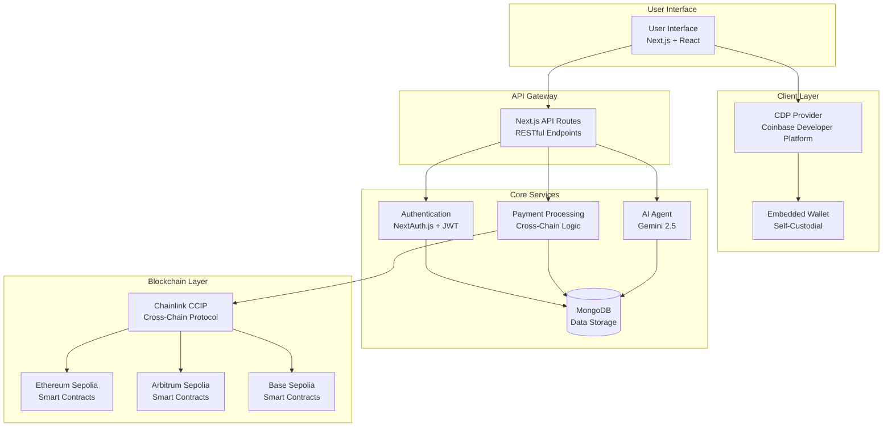
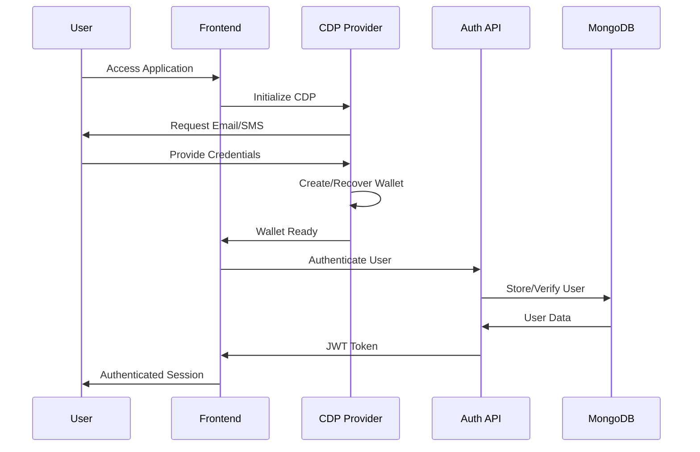
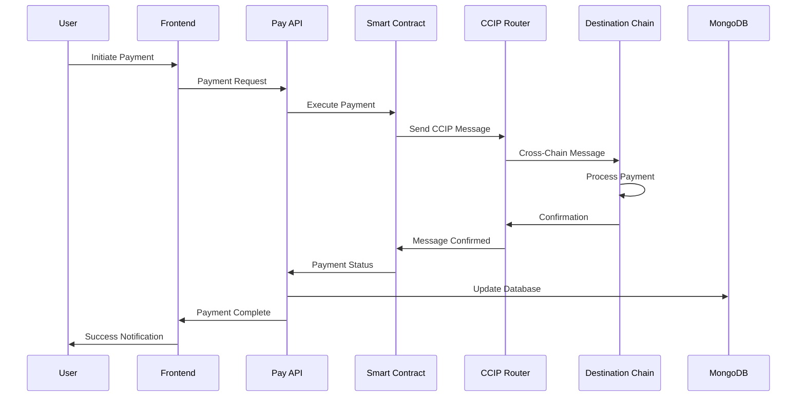
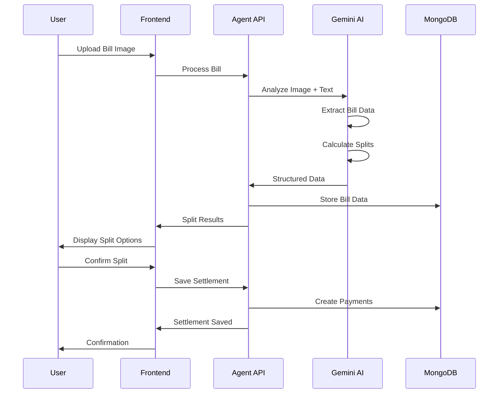
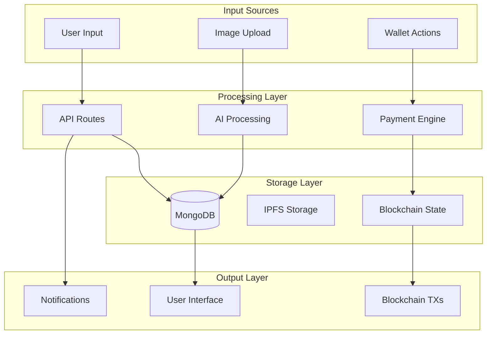
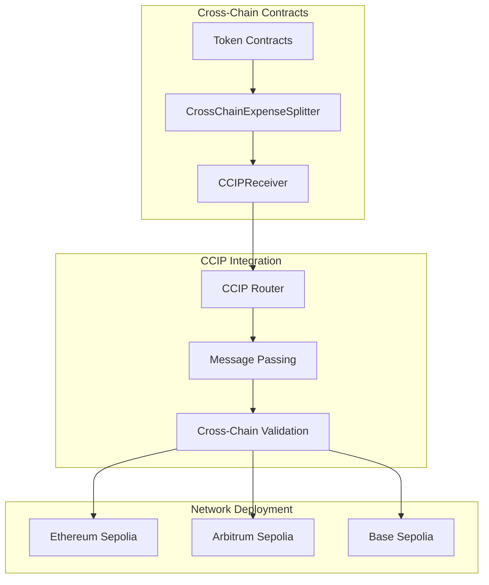
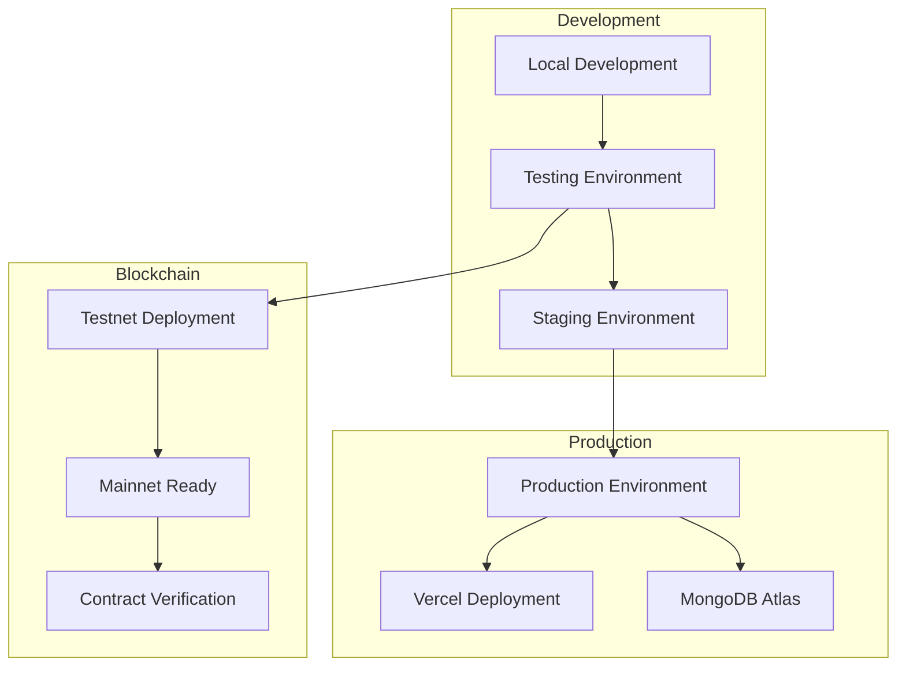
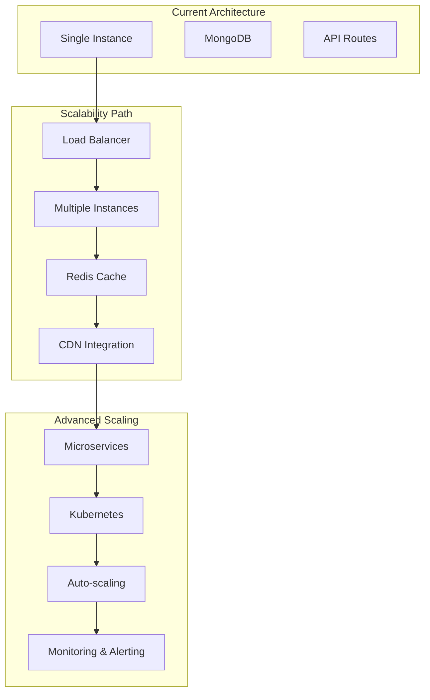
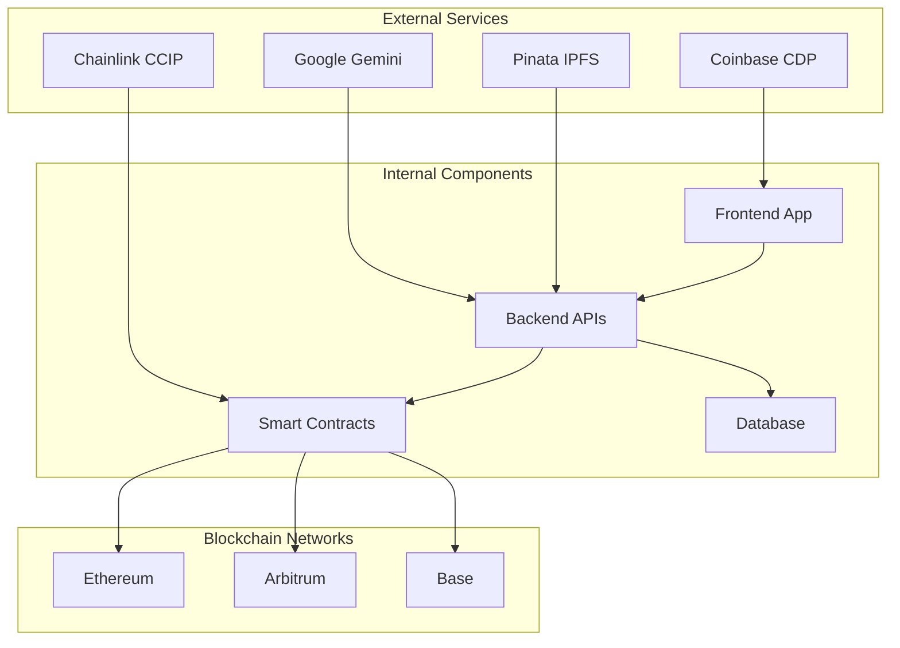

# AnyPay - System Architecture Flowcharts

## 1. High-Level System Architecture

## 2. User Authentication Flow

## 3. Cross-Chain Payment Flow

## 4. AI Agent Bill Splitting Flow

## 5. Data Flow Architecture

## 6. Smart Contract Architecture

## 7. Security Architecture

```mermaid
graph TB
    subgraph "Authentication Security"
        JWT[JWT Tokens]
        SIGNATURE[Wallet Signatures]
        SESSION[Session Management]
    end

    subgraph "Smart Contract Security"
        CCIP_SEC[CCIP Protocol Security]
        REENTRANCY[Reentrancy Protection]
        VALIDATION[Input Validation]
    end

    subgraph "Data Security"
        ENCRYPTION[Database Encryption]
        RATE_LIMIT[API Rate Limiting]
        SANITIZATION[Input Sanitization]
    end

    subgraph "Network Security"
        HTTPS[HTTPS/TLS]
        CORS[CORS Policies]
        HEADERS[Security Headers]
    end

    JWT --> SESSION
    SIGNATURE --> SESSION
    CCIP_SEC --> REENTRANCY
    REENTRANCY --> VALIDATION
    ENCRYPTION --> RATE_LIMIT
    RATE_LIMIT --> SANITIZATION
    HTTPS --> CORS
    CORS --> HEADERS
```

## 8. Deployment Architecture

## 9. Scalability Architecture

## 10. Integration Points

These flowcharts provide a comprehensive visual representation of the AnyPay system architecture, showing the relationships between different components, data flows, and system interactions. Each diagram focuses on a specific aspect of the system to provide clarity on how different parts work together.
