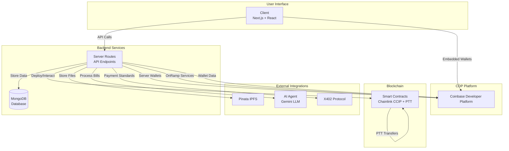
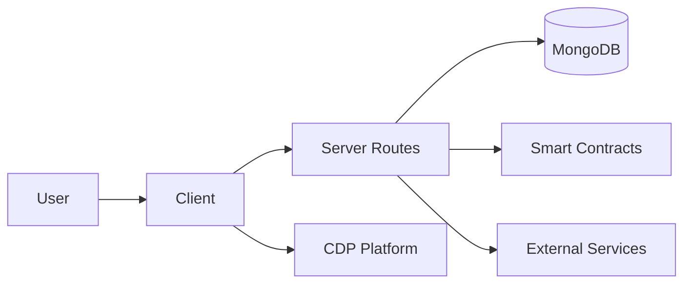

# AnyPay - High-Level Tech Stack Architecture

## Core Technology Stack

AnyPay uses a simplified, high-level architecture focused on cross-chain payments and embedded wallets.

## High-Level Tech Stack Diagram

## Technology Components

| Component           | Technology           | Purpose                                 |
| ------------------- | -------------------- | --------------------------------------- |
| **Client**          | Next.js + React      | User interface and interactions         |
| **MongoDB**         | MongoDB              | Data storage and persistence            |
| **Server Routes**   | Next.js API Routes   | Backend API endpoints                   |
| **Smart Contracts** | Solidity + Chainlink | Cross-chain contracts with CCIP and PTT |
| **Pinata**          | IPFS                 | File and image storage                  |
| **AI Agent**        | Google Gemini        | AI-powered bill splitting               |
| **X402**            | X402 Protocol        | Payment standards                       |
| **CDP Platform**    | Coinbase CDP         | Complete wallet infrastructure          |

## High-Level Data Flow

## Core Architecture Benefits

- **Simplified Stack**: Focused on essential components only
- **Cross-Chain Ready**: Chainlink CCIP and PTT integration
- **Embedded Wallets**: CDP-powered wallet infrastructure
- **AI Integration**: LLM-powered bill splitting
- **Decentralized Storage**: IPFS for file management
- **Payment Standards**: X402 protocol compliance

This high-level architecture provides a clean, focused foundation for cross-chain payments with embedded wallets.
